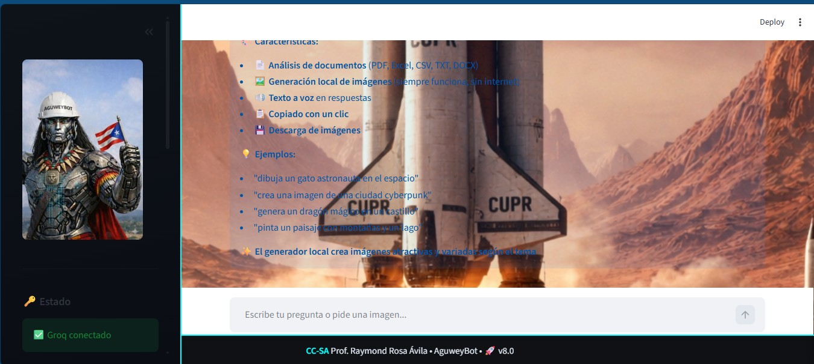

# 🎨 AguweyBot - Asistente Híbrido con Generación Local de Imágenes

**AguweyBot** es una aplicación web creada con **Streamlit** que combina:

- Asistente conversacional inteligente (usando **Groq + Llama 3.3 70B**)
- Análisis completo de documentos (PDF, Excel, CSV, TXT, DOCX)
- Generador de imágenes **100% local** (sin depender de APIs externas ni internet)
- Texto a voz (opcional con gTTS)
- Interfaz moderna con efectos visuales y modo oscuro cyber-futurista

> **Lo más destacado**: el generador de imágenes **siempre funciona**, incluso sin conexión a internet.

<br>

## ✨ Características principales

| Característica                        | Estado          | Notas                                      |
|:--------------------------------------|:---------------:|--------------------------------------------|
| Chat con Groq (Llama 3.3 70B)         | ✓               | Streaming + historial limitado             |
| Generación de imágenes **local**      | ✓               | 100% offline – usa Pillow                  |
| Análisis de PDF (texto completo)      | ✓               | Lee todas las páginas                      |
| Lectura de Excel / CSV                | ✓               | Muestra tabla + texto completo             |
| Soporte DOCX y TXT                    | ✓               | Extracción de párrafos y tablas            |
| Texto a voz (español)                 | opcional        | Requiere `gtts`                            |
| Botón de copiar respuesta             | ✓               | Con feedback visual                        |
| Descarga de imágenes generadas        | ✓               | PNG directo                                |
| Interfaz cyber-futurista              | ✓               | Fondo + efectos neón                       |
| Modo oscuro + scrollbar personalizado | ✓               | CSS avanzado                               |

<br>

## 📸 Ejemplos de uso
dibuja un gato astronauta en el espacio
crea una ciudad cyberpunk al atardecer
genera un dragón dorado volando sobre montañas
pinta un paisaje japonés con cerezos en flor
hazme un retrato futurista de una mujer cyborg
textEl generador local crea fondos temáticos, formas decorativas, texto centrado y efectos según palabras clave detectadas.

<br>

## 🚀 Instalación rápida (entorno local)

### 1. Requisitos mínimos

- Python 3.9 – 3.12
- Sistema operativo: Windows / macOS / Linux

### 2. Clonar el repositorio

```bash
git clone https://github.com/TU-USUARIO/aguweybot.git
cd aguweybot
3. Crear entorno virtual (recomendado)
Bash# Windows
python -m venv venv
venv\Scripts\activate

# macOS / Linux
python3 -m venv venv
source venv/bin/activate
4. Instalar dependencias
Bashpip install -r requirements.txt
(crea este archivo si aún no existe – ver más abajo)
5. Configurar la API Key de Groq
Crea archivo .streamlit/secrets.toml con:
tomlGROQ_API_KEY = "gsk_xxxxxxxxxxxxxxxxxxxxxxxxxxxxxxxxxxxxxxxxxxxx"
O pásala como variable de entorno:
Bashexport GROQ_API_KEY="gsk_..."
6. (Opcional) Activar texto a voz
Bashpip install gtts
7. Ejecutar
Bashstreamlit run AguweyBotWebPro1PC.py
¡Listo! Abre http://localhost:8501


requirements.txt recomendado (2025)
textstreamlit>=1.38.0
langchain-groq>=0.2.0
PyPDF2>=3.0.1
python-docx>=1.1.2
pandas>=2.2.0
openpyxl>=3.1.0
Pillow>=10.4.0
gtts>=2.5.3               # opcional - texto a voz
chardet>=5.2.0


🖼️ Capturas de pantalla





📄 Licencia
Creative Commons Attribution-ShareAlike 4.0 International
(CC BY-SA 4.0)

Puedes usar, modificar y distribuir este código
Debes dar crédito al autor original (Raymond Rosa Ávila)
Si creas obras derivadas, debes publicarlas bajo la misma licencia

Ver licencia completa →


✍️ Autor
Raymond Rosa Ávila
Profesor • Desarrollador • Entusiasta de IA y visualización
📧 raymond.rosa.avila [at] gmail.com
🌐 https://github.com/TU-USUARIO


🙏 Agradecimientos

Groq – por la velocidad increíble de inferencia
Streamlit – framework más rápido para prototipos
Comunidad open-source de Pillow, LangChain, gTTS y PyPDF2

¡Espero que disfrutes usando y modificando AguweyBot! 🚀
¿Encontraste útil el proyecto?
→ Dale una ⭐ en GitHub
→ Comparte tus creaciones hechas con el generador local
¡A crear! 🎨🤖
text### Recomendaciones finales para mejorar el README

1. Crea la carpeta `screenshots/` y sube 4–6 imágenes representativas
2. Cambia `TU-USUARIO` por tu nombre real de usuario de GitHub
3. Si tienes un logo (`logo.png`), puedes mostrarlo al inicio con:

```markdown
<p align="center">
  
</p>

Considera agregar badges al inicio (estrellas, forks, licencia, python version):

Markdown[](https://creativecommons.org/licenses/by-sa/4.0/)
[](https://www.python.org/downl
